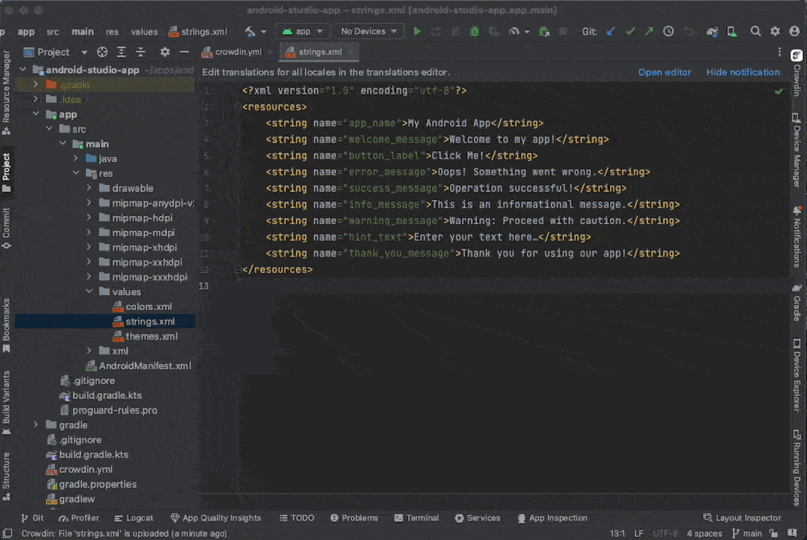
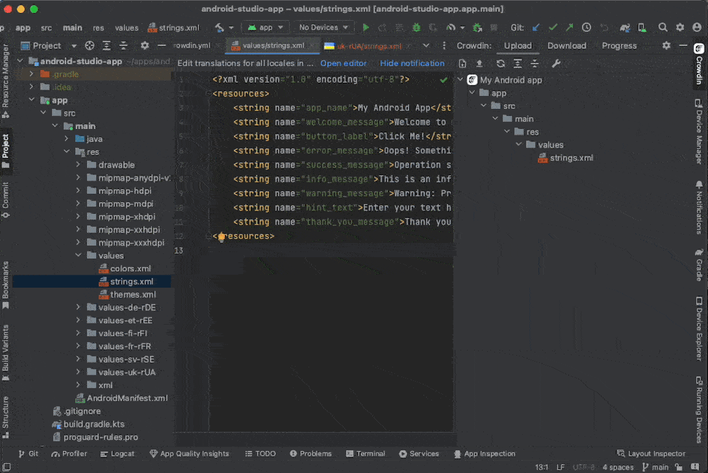
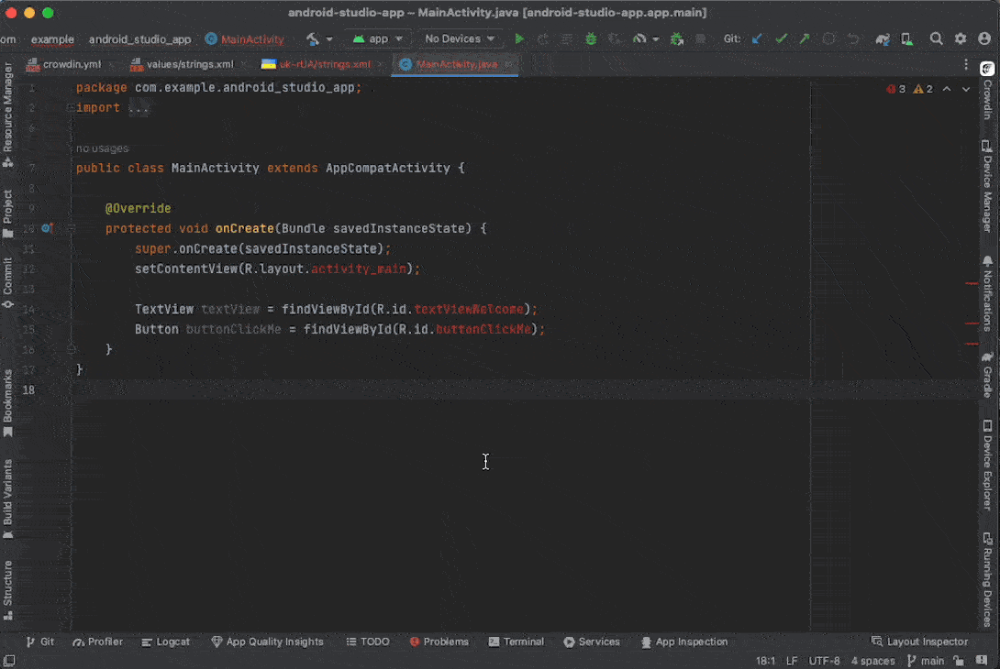
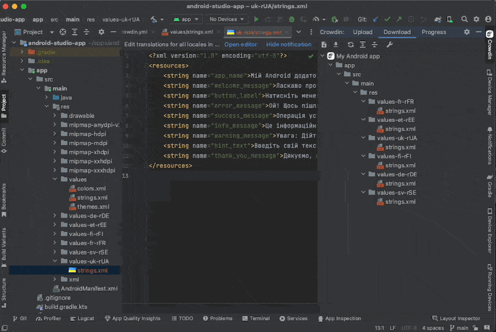
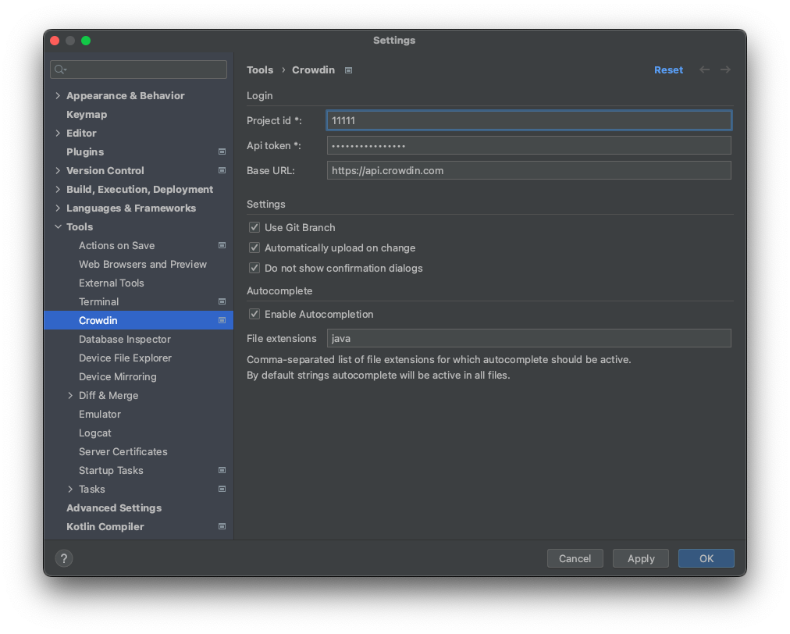

<p align="center">
  <picture>
    <source media="(prefers-color-scheme: dark)" srcset="https://support.crowdin.com/assets/logos/symbol/png/crowdin-symbol-cWhite.png">
    <source media="(prefers-color-scheme: light)" srcset="https://support.crowdin.com/assets/logos/symbol/png/crowdin-symbol-cDark.png">
    
  </picture>
</p>

# Crowdin Android Studio Plugin [](https://twitter.com/intent/tweet?url=https%3A%2F%2Fgithub.com%2Fcrowdin%2Fandroid-studio-plugin&text=Manage%20and%20synchronize%20your%20localization%20resources%20with%20Crowdin%20project%20instantly%20from%20IDE)

Integrate your Android Studio projects with Crowdin to streamline the localization process. The plugin allows you to instantly upload new source strings to your Crowdin project, autocomplete string keys, check translation progress and download translations from Crowdin.

The plugin is compatible with all the **JetBrains IDE's** such as PHPStorm, IntelliJ Idea and other :rocket:

<div align="center">

[](https://github.com/crowdin/android-studio-plugin/actions/workflows/basic.yml)
[](https://codecov.io/gh/crowdin/android-studio-plugin)
[](https://plugins.jetbrains.com/plugin/9463-crowdin)
[](https://plugins.jetbrains.com/plugin/9463-crowdin)

[](https://github.com/crowdin/android-studio-plugin/blob/master/LICENSE)

</div>

## Features

### Upload source files to Crowdin

Upload source files to Crowdin for translation using the _Upload_ tab of the plugin panel. It displays all the source files matching the specified pattern in the configuration file.

<p align="center"></p>

You can also upload existing translations to Crowdin using the _Upload_ tab.

### Download source and translation files from Crowdin

Download source and translation files from Crowdin using the _Download_ tab. It displays all the translation files matching the specified pattern in the configuration file. You can download translations for all target languages, specific target language as well as download source files edited in Crowdin.

<p align="center"></p>

You can also upload and download sources and translations by right-clicking on the file in your project tree and selecting the appropriate option.

If you are using string-based projects, the list of bundles available for download is displayed in the _Download_ tab.

### String keys autocompletion

Use string keys in your code fetched from Crowdin and available in autocomplete suggestions. Whenever a user types something, the IDE autocompletion will suggest available string keys from Crowdin. The suggestion also includes the string text, so you can easily find the right key.

There is a possibility to configure file extensions, where the string keys autocompletion will appear. By default, autocompletion is turned on and available in all files.

<p align="center"></p>

### Track translation and proofreading progress

Track progress of translated and approved strings for each file and target language.

<p align="center"></p>

## Setup

### Installation

Install plugin via [JetBrains Plugin repository](https://plugins.jetbrains.com/idea/plugin/9463-crowdin).

### Obtain credentials

- Create a new Personal Access Token in your Crowdin Account settings.
- Get the Project ID in the _Tools_ > _API_ section on your Crowdin project page.

### Configuration

#### Credentials

To start using this plugin, create a file with project credentials named *crowdin.yml* in the root directory of the project.

```yml
project_id: your-project-id
api_token: your-api-token
```

If you are using Crowdin Enterprise, you also need to specify the `base_url`:

```yml
base_url: https://{organization-name}.api.crowdin.com
```

You can also load the credentials from environment variables:

```yml
project_id_env: CROWDIN_PROJECT_ID
api_token_env: CROWDIN_TOKEN
base_url_env: CROWDIN_BASE_URL
```

If mixed, `project_id`, `api_token` and `base_url` are prioritized:

```yml
project_id_env: CROWDIN_PROJECT_ID                     # Low priority
api_token_env: CROWDIN_TOKEN                           # Low priority
base_url_env: CROWDIN_URL                              # Low priority
project_id: your-project-id                            # High priority
api_token: your-api-token                              # High priority
base_url: https://{organization-name}.api.crowdin.com  # High priority
```

**Tip**: The above options can also be set specifically in the Crowdin plugin settings: `File > Settings > Tools > Crowdin`.

#### Source files and translations

To define source and translation patterns, use the `files' key. Example:

```yml
preserve_hierarchy: true

files:
  - source: "app/src/main/res/values/strings.xml"
    translation: "app/src/main/res/values-%android_code%/%original_file_name%"
  - source: "ext/src/main/res/values/file.xml"
    translation: "ext/src/main/res/values-%android_code%/%original_file_name%"
```

Use `preserve_hierarchy` if your project contains multiple modules that you want to localize with the same source file names.

> [!WARNING]
> Both `source` and `translation` keys should be specified.

> [!NOTE]
> If `preserve_hierarchy` is set to `true`, the plugin will add the path to your translation pattern.
>
> ```yml
> preserve_hierarchy: true
>
> files:
>   - source: "**/values/strings.xml"
>     translation: "/values-%two_letters_code%/%original_file_name%" #CORRECT
>     # This will be converted to 'app/src/main/res/values-%two_letter_code%/%original_file_name%' export pattern for each file
> ```

#### Additional properties

##### Branch

If you are using the branching functionality in Crowdin, you can specify the branch name in the configuration file:

```yml
branch: main
```

Alternatively, you can enable the [Use Git Branch](#use-git-branch) option in the plugin settings to use the local git branch name as the Crowdin branch name.

> [!WARNING]
> For **string-based** projects, the branch name must be specified either in the configuration file or in the plugin settings.

##### File properties

To attach labels to the uploaded strings, use `labels`:

```yml
files:
  - source: "**/values/strings.xml"
    translation: "/values-%two_letters_code%/%original_file_name%"
    labels:
      - android
      - help-menu
```

To specify excluded target languages, use `excluded_target_languages`:

```yml
files:
  - source: "**/values/strings.xml"
    translation: "/values-%two_letters_code%/%original_file_name%"
    excluded_target_languages:
      - uk
      - fr
```

For String-based projects, use the `update_strings` option to update strings with the same identifiers and the `cleanup_mode` option to remove strings that are not present in the uploaded file:

```yml
files:
  - source: "**/values/strings.xml"
    translation: "/values-%two_letters_code%/%original_file_name%"
    update_strings: true
    cleanup_mode: true
```

It's also possible to disable escaping special characters (`=`, `:`, `!` and `#`):

```yml
files:
  - source: "**/values/strings.xml"
    translation: "/values-%two_letters_code%/%original_file_name%"
    escape_special_characters: 0
```

##### Translations upload options

The following properties can be used to configure the import options for uploaded translations:

- `import_eq_suggestions` - Defines whether to add a translation if it's the same as the source string.
- `auto_approve_imported` - Mark uploaded translations as approved.
- `translate_hidden` - Allow translations upload to hidden source strings.

```yml
# Applies to the default behavior and all files
import_eq_suggestions: true
auto_approve_imported: true
translate_hidden: true
```

#### Placeholders

See the [Placeholders](https://support.crowdin.com/configuration-file/#placeholders) article to put appropriate variables.

> [!TIP]
> `%android_code%` placeholder means a format such as `'fr-rCA'` ([<ISO 639-1>](http://www.loc.gov/standards/iso639-2/php/code_list.php) -r[<ISO 3166-1-alpha-2>](https://www.iso.org/obp/ui/#iso:pub:PUB500001:en)). When applying format with only two-letter language code such as `'fr'`([<ISO 639-1>](http://www.loc.gov/standards/iso639-2/php/code_list.php)) format, use `%two_letters_code%` placeholder.

> [!WARNING]
> Currently, the `%original_path%` placeholder is not supported.

### Plugin settings

Plugin settings are located in `File > Settings > Tools > Crowdin`.

<p align="center"></p>

#### Credentials

In the settings menu, you can specify the Project ID, API Token and base URL. Same options can be defined in `crowdin.yml` configuration file.
If these settings are specified in both places, `crowdin.yml` and `Settings` menu, plugin will use values from the configuration file.

#### Use Git Branch

If you are using the branching functionality in Crowdin, you can enable `Use Git Branch` in the plugin settings, so the plugin will use the local git branch name as the Crowdin branch name.

You can also set a specific branch name to work with by using the `branch` option in the `crowdin.yml` configuration file.

If you are not using branching, make sure the `Use Git Branch` option is disabled and `branch` is not defined in the `crowdin.yml` file.

> [!WARNING]
> For **string-based** projects, the branch name must be specified either in the configuration file or in the plugin settings.

#### Automatic uploads

By default, the plugin will automatically upload source files to Crowdin on every change. To disable this, please uncheck the `Automatically upload on change` option.

#### String keys autocompletion

By default, the string keys autocompletion feature is enabled for all files. You can configure file extensions where you want it to work. For example, to enable autocompletion only in json and xml files, the `File extensions` settings should be set to `json,xml`.

To disable autocompletion, uncheck the `Enable autocompletion` option.

## Seeking Assistance

If you find any problems or would like to suggest a feature, please read the [How can I contribute](/CONTRIBUTING.md#how-can-i-contribute) section in our contributing guidelines.

Need help working with Crowdin Android Studio Plugin or have a question? Visit our [Community Forum](https://community.crowdin.com/).

## Contributing

If you would like to contribute please read the [Contributing](/CONTRIBUTING.md) guidelines.

## License
<pre>
The Crowdin Android Studio Plugin is licensed under the MIT License. 
See the LICENSE.md file distributed with this work for additional 
information regarding copyright ownership.

Except as contained in the LICENSE file, the name(s) of the above copyright
holders shall not be used in advertising or otherwise to promote the sale,
use or other dealings in this Software without prior written authorization.
</pre>
